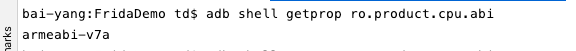
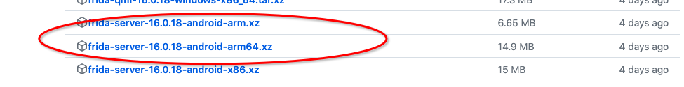
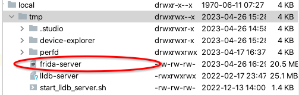
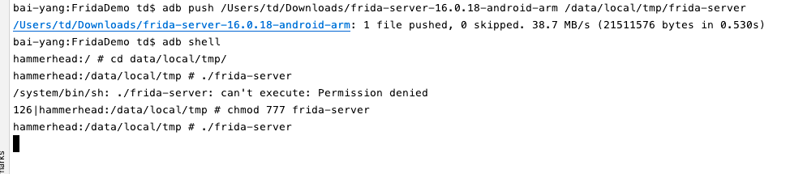

# FridaDemo
## 1.安装frida客户端

1.pip3 install frida-tools

2.pip3 install frida

## 2.安装frida服务端

1.查看我们的手机cpu架构的abi：adb shell getprop ro.product.cpu.abi

例如aremabi-v7a 代表32位的系统



2.git上下载frida服务端链接：https://github.com/frida/frida/releases

由于我们的手机是32位的下载frida-server-16.0.18-android-arm.tar.xz并且解压得到frida-server-16.0.18-android-arm文件




3.将上面的解压得到的文件传送到手机/data/local/tmp 目录，并命名为frida-server：adb push /Users/td/Downloads/frida-server-16.0.18-android-arm /data/local/tmp/frida-server



## 3.启动frida服务

1.cd data/local/tmp/ 目录，修改frida-server权限：chmod 777 frida-server

2.执行./frida-server命令 启动服务



3.开启一个命令窗口运行命令frida-ps -U   查看运行的进程

4.手机端的端口转发到PC端进行通信,端口转发

adb forward tcp:27042 tcp:27042

adb forward tcp:27043 tcp:27043

## 4.调试demo示例

1.android studio 新建FridaDemo，新建MainActivy/Student文件，内容如下：

```java
package com.example.fridademo;

import android.os.Bundle;
import android.util.Log;
import android.view.View;
import android.widget.Button;

import androidx.appcompat.app.AppCompatActivity;

public class MainActivity extends AppCompatActivity {
    private static final String TAG = "MainActivity";
    private Button btn_click;

    @Override
    protected void onCreate(Bundle savedInstanceState) {
        super.onCreate(savedInstanceState);
        setContentView(R.layout.activity_main);
        btn_click = (Button) findViewById(R.id.btn_click);

        btn_click.setOnClickListener(new View.OnClickListener() {
            @Override
            public void onClick(View v) {
                int result = Student.Add(1, 2);
                Log.d(TAG, "onClick: result:" + result);
            }
        });
    }
}
```


```java
package com.example.fridademo;

public class Student {
    static public int Add(int a, int b) {
        return a + b;
    }
}
```

我们目的是hook Student类中的 Add方法，让这个静态函数返回结果为579

2.编写frida_test.js脚本hook文件

新建一个文件夹例如frida，在目录下执行下面这条命令npm i @types/frida-gum

用Visual Studio Code打开新建立的文件，创建frida_test.js，写入如下内容,就是改变hook传入的参数

```js
function main()
{
     //使用java平台
     Java.perform(
        function() {
            //获取java类
            var student=Java.use("com.example.fridademo.Student");
            //hook Add方法(重写Add方法) 
            student.Add.implementation=function(a,b)
            {
                //修改参数
                a=123;
                b=456;
                //调用原来的函数
                var res = this.Add(a,b);
                //输出结果
                console.log(a,b,res);
                return res;
            }
        }
     );
    
}
setImmediate(main)
```

3.运行FridaDemo，在frida_test.js文件目录执行frida -U  -l frida_test.js  FridaDemo 命令

点击按钮查看日志如下修改结果成功：

```
2023-04-26 17:08:34.007 22343-22343 MainActivity            com.example.fridademo                D  onClick: result:3
2023-04-26 17:08:34.655 22343-22343 MainActivity            com.example.fridademo                D  onClick: result:3
2023-04-26 17:08:35.064 22343-22343 MainActivity            com.example.fridademo                D  onClick: result:3
2023-04-26 17:08:35.325 22343-22343 MainActivity            com.example.fridademo                D  onClick: result:3
2023-04-26 17:13:15.616 22343-22343 MainActivity            com.example.fridademo                D  onClick: result:579
2023-04-26 17:13:16.420 22343-22343 MainActivity            com.example.fridademo                D  onClick: result:579
2023-04-26 17:13:16.888 22343-22343 MainActivity            com.example.fridademo                D  onClick: result:579
```


